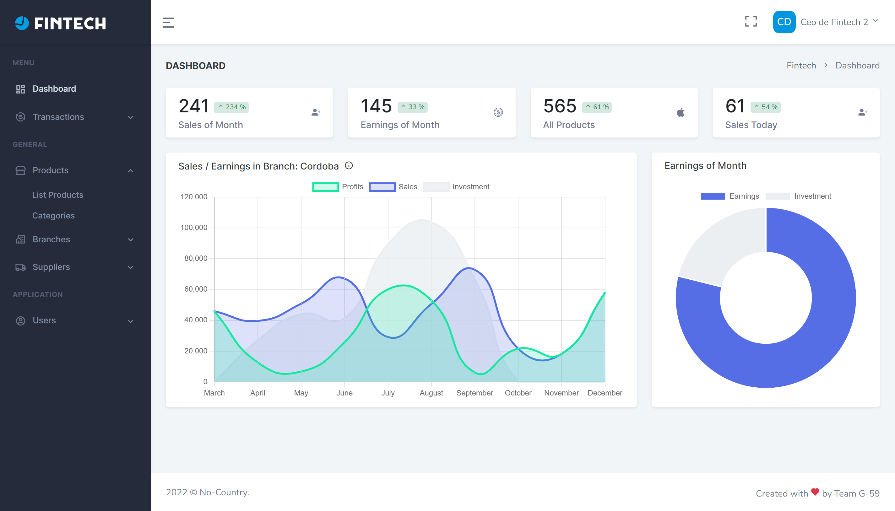

## PROJECT FOR NO-COUNTRY (C2-G59)

     

## Introduction

Create a dashboard that consumes data and has in the same database stored procedures with the different queries. The application should query directly to the database stored procedure and show the visualization. The data can be taken from any free API that you can choose, as long as it is related to the requested theme.

## Requirements

Visualize business data through a dynamic dashboard
* [X] To be able to export the data in excel format
* [ ] To be able to send by mail the results Data storage
* [X] To create the queries in stored procedures (Sequalize)
* [X] To be able to pass some parameter.

## Demo

- [Demo](https://fintech-dashboard.netlify.app)
- [Repository](https://github.com/No-Country/C2-G59)

## Images

## Technologies used

#### FRONTEND
| [React](https://reactjs.org/) |  [React Router Dom](https://v5.reactrouter.com/web/guides/quick-start) | [Redux](https://react-redux.js.org/) | [Chart Js](https://www.chartjs.org/) |
| :-: | :-: | :-: | :-: |
| [Git](https://git-scm.com/) | [React-Table](https://react-table.tanstack.com/) | [React Bootstrap](https://reactjs.org/) | [PWA](https://github.com/postmanlabs) |

#### BACKEND

| [Node](http://nodejs.org/) | [Mysql2](https://github.com/postmanlabs) | [Sequelize](https://github.com/postmanlabs) | [Moment](https://github.com/postmanlabs) |
| :-: | :-: | :-: | :-: |
| [Express-validator](https://github.com/postmanlabs) | [Bcryptjs](https://github.com/postmanlabs) | [JWT](https://github.com/postmanlabs) |[Express](https://github.com/postmanlabs) |

## Install and use

Get the project code:
1. Fork code: `https://github.com/No-Country/C2-G59`
2. Installation dependencies: `npm install`
3. Run: `npm start`

## Roles

| ROLE | EMAIL | PASSWORD |
| :-: | :-: | :-: |
| ADMIN | admin@mail.com  | 123456 |
| CEO | ceo@mail.com | 123456 |
| MANAGER | manager@mail.com  | 123456 |
| USER | user@mail.com  | 123456 |

## Contributors

This project is built by:
- BACKEND :
  - [Freddy Michelena (Team Leader)](https://github.com/ifreddy18)
  - [Mauricio Ferreyra](https://github.com/MauricioRaulFerreyra)
- FRONTEND :
  - [Marcos Escobar (Team Leader)](https://github.com/markosmk)
  - [Pamela Rupay](https://github.com/Alemapyapur)
  - [Rocio Sulca](https://github.com/RocioSulca)

